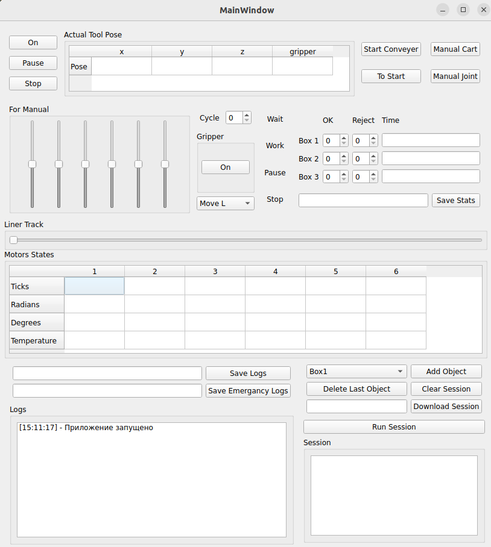

# Интерфейс для управления промышленной роботизированной линии (Ручное управление)
## Установка
Для устновки программы вам потребуется операционная система [Linux (Ubuntu 22.04)](https://releases.ubuntu.com/jammy/), язык программирования [Python](https://www.google.com/url?sa=t&source=web&rct=j&opi=89978449&url=https://www.python.org/&ved=2ahUKEwjOk9yzp6uSAxVDExAIHazVF4sQFnoECCoQAQ&usg=AOvVaw0QREvGsjwHKp2GtoYvs1JH) и любая программа для редактирования кода (VS Code, PyCharm).
Из библиотек вам понадобятся:
- PyQt5 - библиотека для реализации интерфейса
- Motion - библиотека для управления роботом
- Openpyxl - библиотека для работы с файлами расширения Excel  

Остальные библиотеки (sys, os, math, time и datetime) уже предустановлены в Python.  

Чтоб запустить программу, вам нужно скачать код программы с гита (либо скачать архив, либо скопировать репозиторий через git). После этого вы можете запустить код двумя способами:
- Через терминал: 
```bash 
python3 main.py
```
- Через файл: нужно открыть файл в редакторе кода и нажать кнопку F5

## Функционал
### Кнопки

- **On/Off** - Запуск/Выключение робота
- **Pause/Activate** - Постановка робота на паузу
- **Stop** - Аварийная остановка робота
- **Start/Stop Conveyer** - Запуск/Остановка конвейера
- **To Start** - Перемещение робота в начальную позицию
- **Manual Cart** - Активация/Отключение ручного режима Декарта (по осям x, y, z)
- **Manual Joint** - Активация/Отключение ручного режима Сочленений (по шестью звеньям)
- **On/Off (Gripper)** - Включение/Отключение захвата
- **Save Stats** - Сохранение статистики
- **Save Logs** - Сохранение логов
- **Save** Emergancy Logs - Сохранение аварийных логов

### Джостики

- **For Manual** - Джостики для ручного управления роботом (первые 3 для режима Декарта, все 6 для режима Сочленений)
- **Liner track** - Перемещение робота по линейному треку

### Таблицы

- **Actual Tool Pose** - отображение текущий позиции схвата   

|      |  x  |  y  |  z  |
|-----:|:---:|:---:|:----|
| pose |0.000|0.000|0.000|

- **Mototrs States** - отображение текущего состояния моторов робота (по тикам, радианам, градусам и температуре)

|             |  1  |  2  |  3  |  4  |  5  |  6  |
|------------:|:---:|:---:|:---:|:---:|:---:|:----|
| ticks       |0.000|0.000|0.000|0.000|0.000|0.000|
| radians     |0.000|0.000|0.000|0.000|0.000|0.000|
| degrees     |0.000|0.000|0.000|0.000|0.000|0.000|
| temperature |0.000|0.000|0.000|0.000|0.000|0.000|

### Текстовые поля

- **Logs** - отображение всех логов за время работы одной сессии программы

## Внешний вид интерфейса
